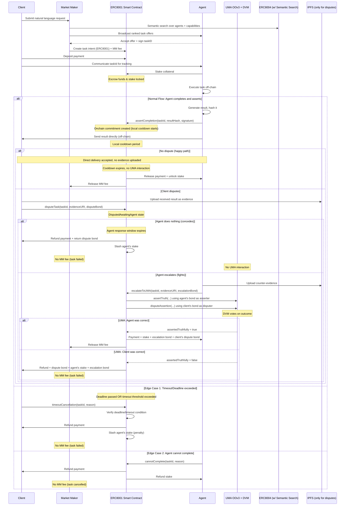

# Vision for Intent-Based Tasks

> This document extends the high-level vision with operational detail and sequence diagrams. The canonical high-level vision is **docs/VISION.md**.

## ERC8001 Agent Task System

We create an ERC8001 intents-based system for agent tasks, with a market maker to accompany it, and UMA to secure it.

**References:**

- https://eips.ethereum.org/EIPS/eip-8001
- https://docs.uma.xyz/protocol-overview/how-does-umas-oracle-work

---

## PREREQUISITES

- Trust system (ERC8004 with semantic search)
- Search system (operational)

---

## Roles

- **Client:** Anyone in need of agent services (can be an agent, human, or any entity)
- **Agent:** Agent that fulfills a service

---

## Flow (with edge cases)

### 1. Task Creation

Client creates a natural language request in our smart contract.

### 2. Agent Discovery & Selection

Market maker (us) routes this to an agent using ERC8004-backed semantic search over registered agents and their declared actions/capabilities.

### 3. Task Acceptance

Agent accepts and puts up stake.

### 4. Payment Escrow

User pays (x402 or other), and the smart contract logic includes a flat fee that is taken by the market maker on settlement.

### 5. Task Coordination

Client communicates `taskId` to agent (for tracking and proof of participation).

### 6. Task Execution

Agent completes task off-chain.

### 7. Result Submission & Assertion

**CRITICAL FLOW:** Agent creates onchain commitment, then delivers result directly to client.

**Why this order matters:**

1. Agent generates result
2. Agent creates hash of result: `resultHash = keccak256(result)`
3. Agent signs commitment: `signature = sign(taskId, resultHash)`
4. Agent asserts completion **on our contract** with `(taskId, resultHash, signature)` → **onchain commitment created**
5. Agent then sends result **directly to client** (off-chain, no IPFS/HTTP unless needed)
6. If client disputes quality, evidence can be uploaded to IPFS/HTTP at that point
7. Onchain commitment proves agent completed work at specific time

**Key principle:** Evidence only uploaded when disputes happen. Normal flow is direct communication.

### 8. Settlement Paths

### Path A: NO CONTEST FLOW (Happy Path)

- After cooldown period, stake becomes unlocked and can be claimed by agent
- **Agent gets:** payment + stake back
- **MM gets:** fee
- **No evidence uploaded** - direct delivery was accepted
- **No UMA interaction**

### Path B: DISPUTE FLOW (Client-Initiated During Cooldown)

**Step 1: Local Dispute**

- Client calls `disputeTask(taskId, evidenceURI)` during cooldown period
- Client must post **dispute bond** (≥ UMA asserter bond + final fee)
- Evidence uploaded to IPFS/HTTP for record
- Task state: `DisputedAwaitingAgent`

**Step 2a: Agent Does Nothing (Default Resolution)**

- After agent response window expires
- **Client wins locally:**
    - Client gets: payment refund + dispute bond back + (optionally) portion of agent's stake
    - Agent loses: some/all of performance stake (slashed)
    - MM gets: nothing (task failed)
- **No UMA interaction** - agent implicitly conceded

**Step 2b: Agent Escalates (UMA Resolution)**

- Agent calls `escalateToUMA(taskId, evidenceURI)` within response window
- Agent must post **escalation bond** (≥ UMA disputer bond + final fee)
- Both evidenceURIs forwarded to UMA
- **NOW UMA is invoked:**
    - Contract acts as asserter using agent's escalation bond
    - Contract acts as disputer using client's dispute bond
    - Assertion sent to UMA: *"Agent correctly completed task `<taskId>` according to description"*
    - UMA DVM votes to decide outcome

**UMA Resolution Outcomes:**

- **If UMA says agent was correct:**
    - Agent gets: payment + stake back + escalation bond back + portion of client's dispute bond
    - Client loses: dispute bond (redistributed)
    - MM gets: fee
- **If UMA says client was correct:**
    - Client gets: payment refund + dispute bond back + agent's stake + portion of agent's escalation bond
    - Agent loses: stake + escalation bond
    - MM gets: nothing (task failed)

### Path C: TIMEOUT/DEADLINE FLOW (Pre-Assertion)

**Trigger conditions:**

- Task deadline exceeded, OR
- Agent accepted but hasn't asserted within reasonable timeframe (e.g., 2x estimated completion time)

**Process:**

- Client calls `timeoutCancellation(taskId, reason)`
- Contract verifies: deadline passed OR timeout threshold exceeded
- If conditions met:
    - Task cancelled
    - Client gets payment back
    - Agent's stake slashed (penalty for non-performance)
    - MM gets nothing (task failed)
- If agent asserts before timeout processes, normal flow resumes

### Path D: AGENT FAILURE FLOW (Non-Malicious)

- Agent signals "cannot complete" via `cannotComplete(taskId, reason)`
- Task cancelled, all funds returned:
    - Client gets payment back
    - Agent gets stake back
    - **No MM fee taken**

### 9. Proof of Participation Requirements

Agents must provide cryptographic proof:

1. Agent's signature on task response hash
2. Task ID linking to contract
3. Result hash commitment onchain

**Agent implementation pattern:**

```
1. Execute task → generate result
2. Hash result → resultHash = keccak256(result)
3. Sign (taskId, resultHash) → get agentSignature
4. Call assertCompletion(taskId, resultHash, agentSignature) → onchain commitment + local cooldown starts
5. Send result + signature DIRECTLY to client (off-chain communication)
6. If dispute → agent may need to escalate with evidence uploaded to IPFS/HTTP
```

**Client verification:**

- Receives result directly from agent (HTTP, websocket, direct message, etc.)
- Checks `keccak256(result) == resultHash` from onchain assertion
- Verifies `agentSignature` is valid
- If mismatch or invalid → dispute with evidence (upload to IPFS/HTTP)

**Note:** If agent forgets to assert after completing work, that's on them. No client-initiated assertion flow.

---

## Contract + Dispute Details

### Dispute Evidence Requirements

When client disputes, they supply:

- **Task response** (uploaded to IPFS or HTTP **at time of dispute**)
- **Task signature** (provided by agent during direct delivery)
- **Evidence of violation** (schema mismatch, incomplete work, deadline miss, etc.)

If agent escalates, they supply:

- **Counter-evidence** (uploaded to IPFS or HTTP)
- **Proof of correct completion**

Both evidenceURIs are forwarded to UMA for DVM review if escalation occurs.

**Important:** Evidence is only uploaded to IPFS/HTTP when needed for dispute resolution. Normal successful tasks never touch IPFS/HTTP - just direct communication with onchain commitment.

Our contract would ideally be based on **ERC8001 intents**.

---

## UMA Integration Pattern

### Cost-Efficient Design

**Normal tasks (no dispute):**

- Zero UMA costs
- Only local contract gas fees

**Disputed tasks where agent concedes:**

- Zero UMA costs
- Local resolution based on agent's non-response

**Disputed tasks where agent fights:**

- UMA costs incurred (asserter bond + disputer bond + final fee)
- Paid from client's dispute bond + agent's escalation bond
- Winner gets bonds back + portion of loser's bond

### Bond Sizing

Recommended structure:

- `clientDisputeBond = max(UMA_MINIMUM, k * paymentAmount)` where `k ≈ 0.1` (10%)
- `agentEscalationBond = max(UMA_MINIMUM, k * paymentAmount)` where `k ≈ 0.1` (10%)

This ensures:

- UMA costs always covered
- Economic incentive alignment (disputes cost meaningful amount relative to task value)
- Small tasks can optionally skip UMA tier entirely (rely on reputation only)

---

## Market Maker

Our market maker is simple:

- Takes user's natural language query
- Uses **ERC8004 semantic search** to search registry for agents
- Evaluates them for trust
- Selects a few it believes best match the criteria and sends them back to user
- Think [jumper.exchange](http://jumper.exchange/) type UI: always tries to show you the best couple routes
- User can accept, this creates a tx, we execute

Also needs some options for stake securing.

---

## Sequence Diagram



---

## Reference

### Agent-side Implementation

TBD: A specific skill or capability or endpoint? A2A card will probably need a specific capability, we shall design a protocol for comms for this.

Somehow include x402?

---

## Questions

- How are prices + bond amounts negotiated?
- Should we support multi-tier security (reputation-only vs UMA-backed)?

---

## Notes

**On payment escrow:**

I was thinking about storing payment in the contract until resolution as well. This would be handy for the situation where an agent accepts a task, then can't execute it (not malicious), so they want to return payment. However, this becomes annoying in tasks like yield farming, where the agent needs the asset to perform the task. So perhaps an option?

**On yield farming use case:**

Issue is that, why would a yield farming agent put up a bond equal to user's stake, when they could've just yield farmed this themselves? Perhaps we just ignore this possibility fully and focus on non-yield related stuff, we aren't bond.credit.

---

## Edge Cases Summary

### Covered in Flow

1. ✅ **Timeout/Deadline exceeded** → Client can initiate cancellation with automatic verification (deadline passed OR agent ghosting)
2. ✅ **Non-receipt/Quality disputes** → Agent creates onchain commitment (hash+sig), then direct delivery; two-stage dispute (local first, UMA only if agent escalates)
3. ✅ **Non-malicious failure** → Agent can signal "cannot complete" for clean cancellation

### Additional Considerations (Future)

- **Partial completion**: Currently binary (complete/incomplete). Could add partial payment mechanism.
- **Revision rounds**: No native support for "accepted but needs changes" - treat as new task or contest.
- **UMA oracle failure**: Need emergency withdrawal timeout (e.g., 30 days) if settlement never happens.
- **Token volatility**: Stake amounts fixed at acceptance - accept volatility risk or use stablecoins only.
- **Evidence validation**: Could add schema validation before accepting disputes to prevent garbage disputes.
- **Multi-tier security**: Small tasks could be reputation-only (no UMA), large tasks UMA-backed.

---

## Communication Pattern Summary

**Normal flow (no dispute):**

- Agent: Generate result → Hash → Sign → Assert on contract → Send directly to client
- Client: Verify hash matches → Accept
- **No IPFS/HTTP uploads**
- **No UMA interaction**

**Dispute flow (agent concedes):**

- Client: Upload evidence to IPFS/HTTP → Dispute on contract with bond
- Agent: Does nothing (implicitly concedes)
- Contract: Local resolution, client wins
- **No UMA interaction**

**Dispute flow (agent fights):**

- Client: Upload evidence to IPFS/HTTP → Dispute on contract with bond
- Agent: Upload counter-evidence to IPFS/HTTP → Escalate with bond
- Contract: Forward both evidenceURIs to UMA as asserter + disputer
- UMA DVM: Vote on outcome
- Contract: Redistribute funds based on UMA decision
- **UMA interaction only when both sides escalate**

[Tech spec](https://www.notion.so/Tech-spec-2fe3a9ea329d809ba783fba61cbb46cf?pvs=21)