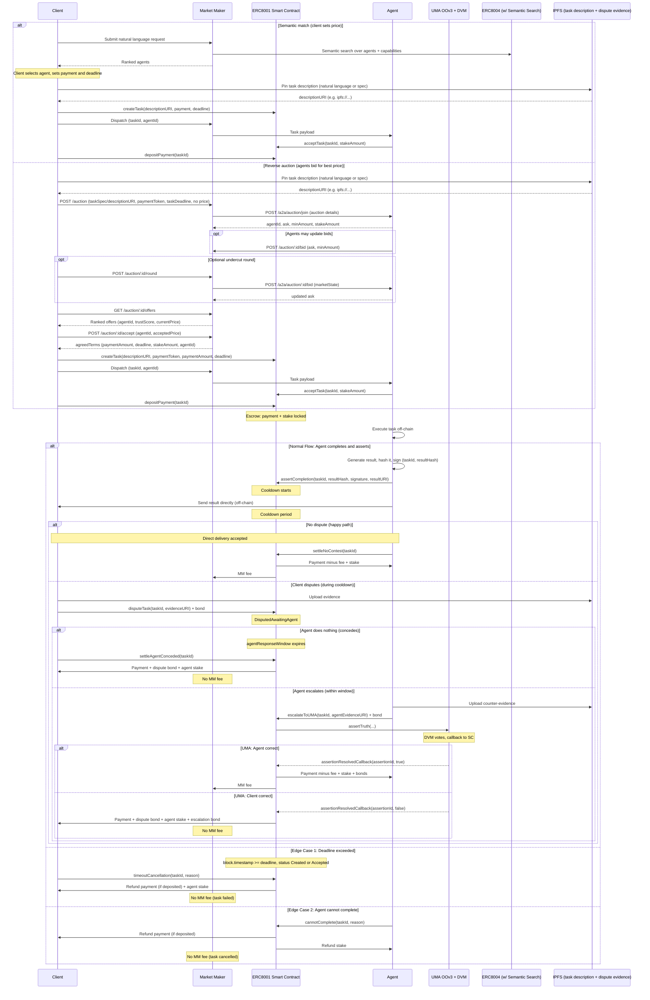

# Vision for Intent-Based Tasks

> This document extends the high-level vision with operational detail and sequence diagrams. The canonical high-level vision is **docs/VISION.md**.

## ERC8001 Agent Task System

We create an ERC8001 intents-based system for agent tasks, with a market maker to accompany it, and UMA to secure it.

**References:**

- https://eips.ethereum.org/EIPS/eip-8001
- https://docs.uma.xyz/protocol-overview/how-does-umas-oracle-work

---

## PREREQUISITES

- Trust system (ERC8004 with semantic search)
- Search system (operational)

---

## Roles

- **Client:** Anyone in need of agent services (can be an agent, human, or any entity)
- **Agent:** Agent that fulfills a service

---

## Flow (with edge cases)

### 1. Task Creation

Client creates a natural language request in our smart contract.

### 2. Agent Discovery & Selection

Market maker (us) routes this to an agent using ERC8004-backed semantic search over registered agents and their declared actions/capabilities.

### 3. Task Acceptance

Agent accepts the task and stakes collateral via `acceptTask(taskId, stakeAmount)`. Stake is held in the contract.

### 4. Payment Escrow

Client deposits payment via `depositPayment(taskId)` (only after task is Accepted). The smart contract logic includes a market-maker fee (basis points) taken on successful settlement.

### 5. Task Coordination

Client communicates `taskId` to agent (for tracking and proof of participation).

### 6. Task Execution

Agent completes task off-chain.

### 7. Result Submission & Assertion

**CRITICAL FLOW:** Agent creates onchain commitment, then delivers result directly to client.

**Why this order matters:**

1. Agent generates result
2. Agent creates hash of result: `resultHash = keccak256(result)`
3. Agent signs commitment: `signature = sign(taskId, resultHash)` (EIP-191 over `keccak256(abi.encode(taskId, resultHash))`)
4. Agent calls **assertCompletion(taskId, resultHash, signature, resultURI)** on the contract. Optional `resultURI` (ipfs:// or https) can point to the result; cooldown starts.
5. Agent sends result **directly to client** (off-chain). Client can also fetch from `resultURI` if set.
6. If client disputes quality, evidence is uploaded to IPFS/HTTP and client calls `disputeTask(taskId, clientEvidenceURI)` (with dispute bond) during cooldown.
7. Onchain commitment proves agent completed work at a specific time.

**Key principle:** Evidence only uploaded when disputes happen. Normal flow is direct communication.

### 8. Settlement Paths

### Path A: NO CONTEST FLOW (Happy Path)

- After cooldown period expires, **agent** calls `settleNoContest(taskId)` to settle.
- **Agent gets:** payment (minus MM fee) + stake back
- **MM gets:** fee (marketMakerFeeBps of payment)
- **No evidence uploaded** — direct delivery was accepted
- **No UMA interaction**

### Path B: DISPUTE FLOW (Client-Initiated During Cooldown)

**Step 1: Local Dispute**

- Client calls `disputeTask(taskId, clientEvidenceURI)` **before** cooldown expires (`block.timestamp < cooldownEndsAt`). Client pays dispute bond (token transfer); bond size = `(paymentAmount * disputeBondBps) / 10000`.
- Evidence uploaded to IPFS/HTTP and URI passed as `clientEvidenceURI`.
- Task state: `DisputedAwaitingAgent`.

**Step 2a: Agent Does Nothing (Default Resolution)**

- After `cooldownEndsAt + agentResponseWindow` has passed, **client** calls `settleAgentConceded(taskId)`.
- **Client wins locally:**
    - Client gets: payment refund + dispute bond back + agent's stake (full stake to client)
    - Agent loses: performance stake
    - MM gets: nothing (task failed)
- **No UMA interaction** — agent implicitly conceded

**Step 2b: Agent Escalates (UMA Resolution)**

- Agent calls `escalateToUMA(taskId, agentEvidenceURI)` within **agent response window** (before `cooldownEndsAt + agentResponseWindow`). Agent pays escalation bond: `max((paymentAmount * escalationBondBps) / 10000, umaConfig.minimumBond)`.
- Both `clientEvidenceURI` and `agentEvidenceURI` are encoded in the UMA claim.
- **UMA is invoked:**
    - Contract acts as asserter using agent's escalation bond
    - Contract acts as disputer using client's dispute bond
    - Assertion sent to UMA: *"Agent correctly completed task `<taskId>` according to description"*
    - UMA DVM votes to decide outcome

**UMA Resolution Outcomes:**

- **If UMA says agent was correct:**
    - Agent gets: payment + stake back + escalation bond back + portion of client's dispute bond
    - Client loses: dispute bond (redistributed)
    - MM gets: fee
- **If UMA says client was correct:**
    - Client gets: payment refund + dispute bond back + agent's stake + portion of agent's escalation bond
    - Agent loses: stake + escalation bond
    - MM gets: nothing (task failed)

### Path C: TIMEOUT/DEADLINE FLOW (Pre-Assertion)

**Trigger:** Task **deadline** has been exceeded (contract does not enforce a separate "agent hasn't asserted" timeout; only `deadline` is checked). Task must still be in `Created` or `Accepted` status.

**Process:**

- Client calls `timeoutCancellation(taskId, reason)`
- Contract verifies: `block.timestamp >= deadline` and status is Created or Accepted
- If conditions met:
    - Task set to TimeoutCancelled
    - If client had deposited payment, client gets payment back
    - Agent's stake is transferred to the client (penalty for non-performance)
    - MM gets nothing (task failed)
- If agent asserts before client calls timeout, normal flow applies instead

### Path D: AGENT FAILURE FLOW (Non-Malicious)

- Agent signals "cannot complete" via `cannotComplete(taskId, reason)`
- Task cancelled, all funds returned:
    - Client gets payment back
    - Agent gets stake back
    - **No MM fee taken**

### 9. Proof of Participation Requirements

Agents must provide cryptographic proof:

1. Agent's signature on task response hash
2. Task ID linking to contract
3. Result hash commitment onchain

**Agent implementation pattern:**

```
1. Execute task → generate result
2. Hash result → resultHash = keccak256(result)
3. Sign (taskId, resultHash) → get agentSignature (EIP-191)
4. Call assertCompletion(taskId, resultHash, agentSignature, resultURI) → onchain commitment + cooldown starts (resultURI optional)
5. Send result + signature directly to client (off-chain)
6. After cooldown expires with no dispute, call settleNoContest(taskId) to receive payment + stake
7. If client disputes, agent may escalate with escalateToUMA(taskId, agentEvidenceURI) (and bond) within agentResponseWindow
```

**Client verification:**

- Receives result directly from agent (or fetches from task's resultURI if set)
- Checks `keccak256(result) == resultHash` from onchain assertion
- Verifies `agentSignature` is valid
- If mismatch or invalid → dispute during cooldown with `disputeTask(taskId, evidenceURI)` (pay dispute bond). After agent response window with no escalation, call `settleAgentConceded(taskId)`.

**Note:** If agent forgets to assert after completing work, that's on them. No client-initiated assertion flow.

---

## Contract + Dispute Details

### Dispute Evidence Requirements

When client disputes (during cooldown), they call `disputeTask(taskId, clientEvidenceURI)` and post the dispute bond. The clientEvidenceURI typically points to:

- Task response (as received from agent)
- Task signature (from agent)
- Evidence of violation (schema mismatch, incomplete work, etc.)

If agent escalates (within agentResponseWindow), they call `escalateToUMA(taskId, agentEvidenceURI)` and post the escalation bond. The agentEvidenceURI points to counter-evidence. Both URIs are encoded in the UMA claim for DVM review.

**Important:** Evidence is only uploaded to IPFS/HTTP when needed for dispute resolution. Normal successful tasks never touch IPFS/HTTP — just direct communication with onchain commitment.

The contract implements this flow and is aligned with **ERC8001** intents.

---

## UMA Integration Pattern

### Cost-Efficient Design

**Normal tasks (no dispute):**

- Zero UMA costs
- Only local contract gas fees

**Disputed tasks where agent concedes:**

- Zero UMA costs
- Local resolution based on agent's non-response

**Disputed tasks where agent fights:**

- UMA costs incurred (asserter bond + disputer bond + final fee)
- Paid from client's dispute bond + agent's escalation bond
- Winner gets bonds back + portion of loser's bond

### Bond Sizing

Contract uses basis points of payment amount:

- **Dispute bond:** `clientDisputeBond = (paymentAmount * disputeBondBps) / 10000` (e.g. 1000 bps = 10%). Client must transfer this when calling `disputeTask`.
- **Escalation bond:** `agentEscalationBond = max((paymentAmount * escalationBondBps) / 10000, umaConfig.minimumBond)`. Agent must transfer this when calling `escalateToUMA`.

This ensures UMA costs can be covered and escalation bond meets the oracle minimum.

---

## Market Maker

Our market maker is simple:

- Takes user's natural language query
- Uses **ERC8004 semantic search** to search registry for agents
- Evaluates them for trust
- Selects a few it believes best match the criteria and sends them back to user
- Think [jumper.exchange](http://jumper.exchange/) type UI: always tries to show you the best couple routes
- User can accept, this creates a tx, we execute

Also needs some options for stake securing.

### Reverse auction (price discovery)

When the client does not set a price, the market maker runs a **reverse auction**: agents compete to offer the best price for the task.

- **Client** submits a task intent (task spec, payment token, deadline) with **no price** via `POST /auction`.
- **Market maker** creates the auction and notifies configured agents by calling each agent’s `POST /a2a/auction/join` with the auction details.
- **Agents** respond with an initial bid: `agentId`, `ask` (price), `minAmount`, optional `stakeAmount` and `taskDeadline`. Agents may also submit or update bids via `POST /auction/:auctionId/bid`.
- **Optional round:** Client or market maker can run `POST /auction/:auctionId/round`. The market maker sends the current market state (competing prices, trust scores) to each agent’s `POST /a2a/auction/:auctionId/bid`; agents may return updated (lower) bids (trust-weighted undercutting).
- **Client** fetches ranked offers with `GET /auction/:auctionId/offers` (ranked by trust-weighted price).
- **Client** accepts one offer with `POST /auction/:auctionId/accept` (agentId, acceptedPrice). The market maker returns **agreed terms** (taskSpec, paymentToken, paymentAmount, deadline, stakeAmount, agentId).
- Client and agent then execute the standard on-chain flow: **createTask** (with agreed paymentAmount/deadline), **acceptTask** (with agreed stakeAmount), **depositPayment**, then execution and settlement as in the main sequence diagram.

---

## Sequence Diagram



---

## Reference

### Agent-side Implementation

TBD: A specific skill or capability or endpoint? A2A card will probably need a specific capability, we shall design a protocol for comms for this.

Somehow include x402?

---

## Questions

- How are prices + bond amounts negotiated?
- Should we support multi-tier security (reputation-only vs UMA-backed)?

---

## Notes

**On payment escrow:**

I was thinking about storing payment in the contract until resolution as well. This would be handy for the situation where an agent accepts a task, then can't execute it (not malicious), so they want to return payment. However, this becomes annoying in tasks like yield farming, where the agent needs the asset to perform the task. So perhaps an option?

**On yield farming use case:**

Issue is that, why would a yield farming agent put up a bond equal to user's stake, when they could've just yield farmed this themselves? Perhaps we just ignore this possibility fully and focus on non-yield related stuff, we aren't bond.credit.

---

## Edge Cases Summary

### Covered in Flow

1. ✅ **Timeout/Deadline exceeded** → Client calls `timeoutCancellation` when `block.timestamp >= deadline` (task still Created or Accepted). Contract transfers payment and agent stake to client.
2. ✅ **Non-receipt/Quality disputes** → Agent creates onchain commitment (hash + sig, optional resultURI), then direct delivery; client may dispute during cooldown; agent may escalate within agentResponseWindow; UMA resolves if escalated.
3. ✅ **Non-malicious failure** → Agent calls `cannotComplete` for clean cancellation (payment and stake returned).

### Additional Considerations (Future)

- **Partial completion**: Currently binary (complete/incomplete). Could add partial payment mechanism.
- **Revision rounds**: No native support for "accepted but needs changes" - treat as new task or contest.
- **UMA oracle failure**: Need emergency withdrawal timeout (e.g., 30 days) if settlement never happens.
- **Token volatility**: Stake amounts fixed at acceptance - accept volatility risk or use stablecoins only.
- **Evidence validation**: Could add schema validation before accepting disputes to prevent garbage disputes.
- **Multi-tier security**: Small tasks could be reputation-only (no UMA), large tasks UMA-backed.

---

## Communication Pattern Summary

**Normal flow (no dispute):**

- Agent: Generate result → Hash → Sign → assertCompletion(taskId, resultHash, signature, resultURI) → Send result directly to client
- After cooldown: Agent calls settleNoContest(taskId) → receives payment (minus MM fee) + stake
- **No IPFS/HTTP uploads**
- **No UMA interaction**

**Dispute flow (agent concedes):**

- Client: Upload evidence → disputeTask(taskId, evidenceURI) with bond (during cooldown)
- Agent: Does nothing within agentResponseWindow
- After cooldownEndsAt + agentResponseWindow: Client calls settleAgentConceded(taskId) → client receives payment + dispute bond + agent stake
- **No UMA interaction**

**Dispute flow (agent fights):**

- Client: disputeTask(taskId, evidenceURI) with bond
- Agent: escalateToUMA(taskId, agentEvidenceURI) with bond (within agentResponseWindow)
- Contract: assertTruth to UMA; DVM votes; oracle calls assertionResolvedCallback on contract
- Contract: Redistributes funds (agent or client wins)
- **UMA interaction only when agent escalates**

[Tech spec](https://www.notion.so/Tech-spec-2fe3a9ea329d809ba783fba61cbb46cf?pvs=21)